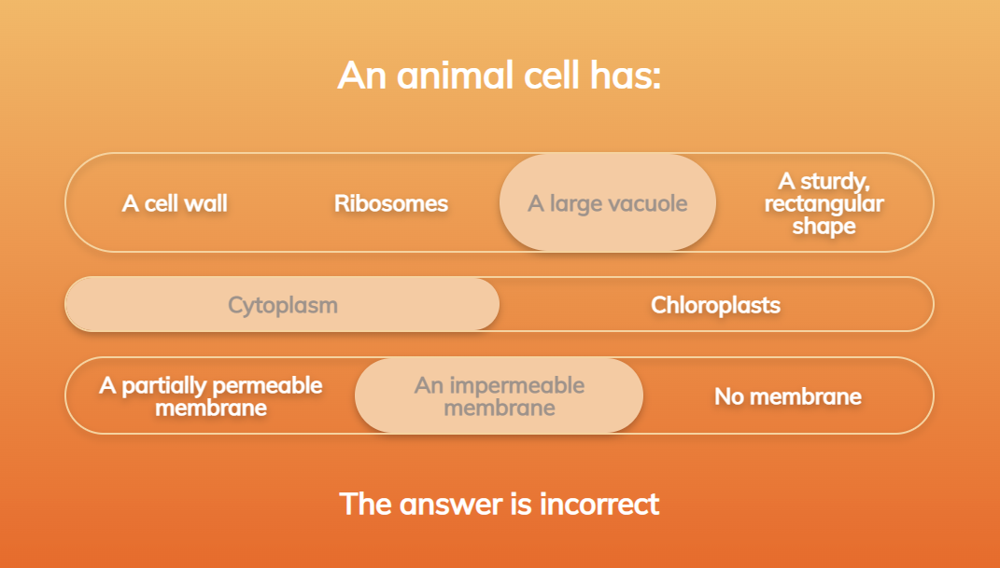
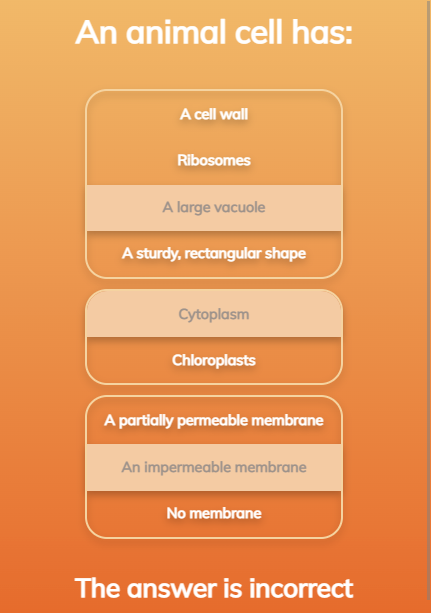

# Multiple Choice Question Component

This is a demo of a stylish multiple-choice question component in React

Horizontal layout:

Vertical layout:

## Installation

1. Clone the repo to your machine
2. `npm i`
3. `npm start`

## Features

* Support for 2, 3, or more options per choice, and any number of choices per question
* Animated background sliders
* Responsive layout
* Randomized order of choices & options
* The question prevents further changes once solved

## Limitations

* Bugs:
  * Sometimes when resizing the window to < 600px wide, the background get misplaced in the vertical layout. This can be fixed by making any selection, forcing the element to re-render.
